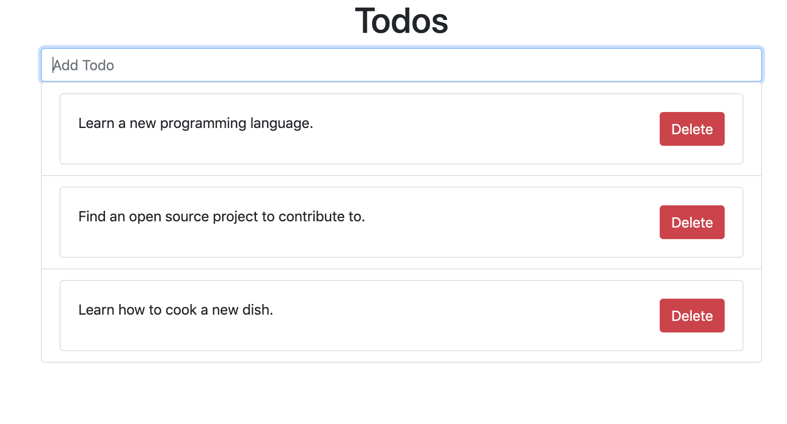

# Todo-React
A Todo app built with React. Built this while learning Reactjs.

## Install dependencies

`npm install`

## Run the app in development mode.

`npm start`

Open [http://localhost:3000](http://localhost:3000) to view it in the browser.

You should see a page like this(your list of todos will be empty at first.)

### Launch the test runner

`npm test`

See the section about [running tests](https://facebook.github.io/create-react-app/docs/running-tests) for more information.

### Build the app for production

`npm run build`

Builds the app for production to the `build` folder. 
It correctly bundles React in production mode and optimizes the build for the best performance.

The build is minified and the filenames include the hashes. 
Your app is ready to be deployed!
